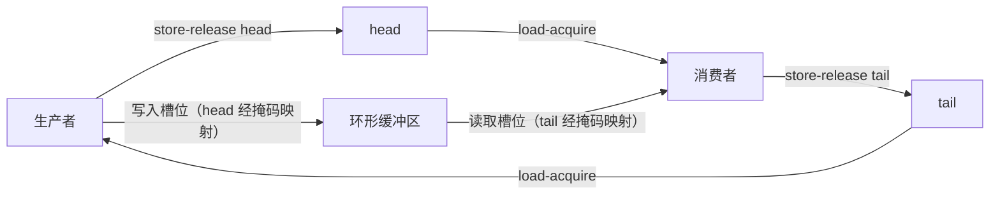

# SPSC 无锁环形队列设计说明

本目录的 [main.cpp](main.cpp) 实现了一个 **SPSC（Single Producer, Single Consumer）无锁环形队列**：仅允许一个生产者调用 `tryPush()`，仅允许一个消费者调用 `tryPop()`。

它适合固定角色线程间的低延迟消息传递，例如行情接收线程到策略线程、策略线程到订单发送线程。

> 不可将此实现直接用于 MPSC、SPMC 或 MPMC 场景；这些模型需要 CAS 或每槽位序号等不同的并发算法。

## 使用场景

SPSC 队列适用于**生产和消费角色固定，且每条消息只需要经过一个生产者和一个消费者**的流水线边界。典型场景包括：

| 场景 | 生产者 | 消费者 | 传递内容 |
|---|---|---|---|
| 行情处理 | 网络接收线程 | 策略线程 | 逐笔成交、盘口更新、行情快照 |
| 订单处理 | 策略线程 | 下单线程 | 下单、撤单、改单请求 |
| 风控流水线 | 策略线程 | 风控线程 | 待校验订单或仓位变更 |
| 日志与落盘 | 业务线程 | 专用日志线程 | 审计事件、指标、二进制日志块 |
| 实时处理 | 采集线程 | 编码或计算线程 | 音视频帧、传感器采样、网络数据包 |

一个多阶段系统通常为相邻阶段分别建立一条队列，而不是让多个线程共享同一条队列：


每一条边都严格满足一个写者和一个读者，因此可避免多线程竞争 `head` 或 `tail`，并使用本实现的无锁设计。

### 一条队列只能连接一个生产者和一个消费者

该限制针对的是**同一个 `SpscQueue` 实例**，而不是整个系统。对于一条队列：

- 只有一个线程可以调用 `tryPush()`；
- 只有一个线程可以调用 `tryPop()`。

原因是 `head` 和 `tail` 没有使用 CAS 来争夺槽位所有权。两个生产者若同时读取相同的 `head`，可能写入同一个 `buffer_` 槽位；两个消费者若同时读取相同的 `tail`，则可能重复消费同一条消息。这些情况都会产生数据竞争和错误结果。

系统需要多个生产者或消费者时，仍可由多条 SPSC 队列组成：

| 系统需求 | SPSC 组织方式 |
|---|---|
| 多生产者 → 一个消费者 | 每个生产者各有一条队列；消费者轮询或等待所有入队队列。 |
| 一个生产者 → 多消费者 | 每个消费者各有一条队列；生产者按路由规则分发，或为广播写入多条队列。 |
| 多生产者 → 多消费者 | 将工作按 key、品种或连接分片，并用多条 SPSC 队列连接相邻阶段；若无法分片，则使用专用 MPMC 队列。 |

SPSC 的性能优势正来自这一 $1 \to 1$ 约束：每个进度变量只有一个写者，不需要多个线程之间的 CAS 竞争。

不适用的情形：

- 多个线程同时调用同一个队列的 `tryPush()`：需要 MPSC 或 MPMC 队列；
- 多个线程同时调用同一个队列的 `tryPop()`：需要 SPMC 或 MPMC 队列；
- 生产或消费端需要等待、超时、取消、优先级或动态扩容语义：通常应使用更高层的并发容器或在外层补充协调机制；
- 生产者和消费者速率长期严重失衡且不能接受满时重试或丢弃：需要背压、容量规划或持久化缓冲方案。

## 结构与数据流

队列由三部分组成：

- `buffer_`：固定容量、连续存储的环形缓冲区；
- `producer_`：生产者独占写入 `head`，并缓存 `cachedTail`；
- `consumer_`：消费者独占写入 `tail`，并缓存 `cachedHead`。



`head` 和 `tail` 是持续递增的逻辑序号，不会在到达数组尾部时归零；只有访问 `buffer_` 时才映射为数组下标。

## 为什么容量必须是 2 的幂

容量受以下断言约束：

```cpp
static_assert((Capacity & (Capacity - 1)) == 0);
```

当 $Capacity=2^n$ 时：

$$sequence \bmod Capacity = sequence \mathbin{\&} (Capacity - 1)$$

所以 [main.cpp](main.cpp#L186-L191) 定义：

```cpp
static constexpr std::size_t kMask = Capacity - 1;
return static_cast<std::size_t>(sequence) & kMask;
```

这用按位与替代取模，实现数组下标回绕。例如容量为 8 时，序号 8、16 都映射到槽位 0。

## 空和满的判定

逻辑队列长度为：

$$length = head - tail$$

因此：

| 条件 | 队列状态 |
|---|---|
| $head-tail=0$ | 空 |
| $head-tail\ge Capacity$ | 满 |

使用单调递增序号避免了单纯回绕下标中 `head == tail` 同时可能表示“空”或“满”的歧义。

## 内存序与数据可见性

`buffer_` 不是原子数组，正确性由 `head` 与 `tail` 的 release/acquire 配对保证。

### 生产者发布数据

生产者先写槽位，再发布新的 `head`：

```cpp
buffer_[indexOf(head)] = value;
producer_.head.store(head + 1, std::memory_order_release);
```

消费者通过 `load(acquire)` 观察到该 `head` 后，才能安全读取相应的 `buffer_` 元素：

```cpp
consumer_.cachedHead =
    producer_.head.load(std::memory_order_acquire);
result = buffer_[indexOf(tail)];
```

即：

```text
生产者写 buffer → store-release(head)
                        ↓
                  load-acquire(head) → 消费者读 buffer
```

### 消费者释放槽位

消费者读完槽位后，以 release 更新 `tail`：

```cpp
consumer_.tail.store(tail + 1, std::memory_order_release);
```

生产者以 acquire 读取 `tail` 后，才可安全复用该槽位：

```cpp
producer_.cachedTail =
    consumer_.tail.load(std::memory_order_acquire);
```

### 为什么有些操作是 `relaxed`

生产者是 `head` 的唯一写者，消费者是 `tail` 的唯一写者。因此线程读取自己拥有的进度变量时只需 `relaxed`。只有读取**另一线程已发布的进度**、并据此访问或复用共享槽位时，才需要 `acquire`；发布数据或释放槽位时需要 `release`。

## 对方进度缓存

生产者使用 `cachedTail`，消费者使用 `cachedHead`。它们避免在每次操作时读取另一个 CPU 核频繁修改的原子变量，减少缓存一致性流量。

- 生产者只有在本地判断“可能满”时才读取真实 `tail`；
- 消费者只有在本地判断“可能空”时才读取真实 `head`。

缓存值过期最多导致一次保守的“空”或“满”判断；刷新真实进度后即可继续，不会读取未发布的数据，也不会覆盖未消费的数据。

## 缓存行对齐与伪共享

生产者和消费者分别频繁写入 `head` 与 `tail`。若两者位于同一 cache line，即便访问不同变量，也会因缓存一致性协议互相使缓存行失效，形成伪共享。

本实现分别对齐状态结构：

```cpp
struct alignas(kCacheLineSize) ProducerState { /* ... */ };
struct alignas(kCacheLineSize) ConsumerState { /* ... */ };
```

`buffer_` 也以 cache line 对齐：

```cpp
alignas(kCacheLineSize) std::array<T, Capacity> buffer_{};
```

后者只保证数组首地址对齐，不会让每个元素都占 64 字节。元素保持紧凑连续，有利于空间局部性和硬件预取。

> 示例将 cache line 大小假设为 64 字节。生产环境应按目标 CPU 平台验证。

## 使用方式

```cpp
SpscQueue<MarketEvent, 1U << 16> queue;
```

生产者：

```cpp
while (!queue.tryPush(event)) {
    cpuRelax();
}
```

消费者：

```cpp
MarketEvent event{};
while (!queue.tryPop(event)) {
    cpuRelax();
}
```

`tryPush()` 和 `tryPop()` 在满或空时立即返回 `false`，不阻塞。示例调用方采用忙等与 `cpuRelax()` 来降低延迟；实际系统可按业务需求选择忙等、退避、让出 CPU、信号量、背压或丢弃策略。

## 使用约束

1. 每个队列实例恰好一个生产者和一个消费者。
2. `T` 必须可平凡复制。
3. `Capacity >= 2` 且必须是 2 的幂。
4. 队列存活期间，不得移动、复制或销毁正在被两个工作线程使用的对象。
5. 该实现为低延迟固定容量队列，不是通用并发容器；应在目标 CPU、绑核策略、NUMA 布局与实际消息负载下进行基准测试。
