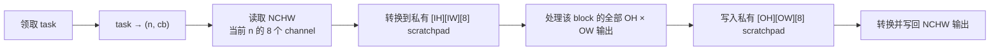
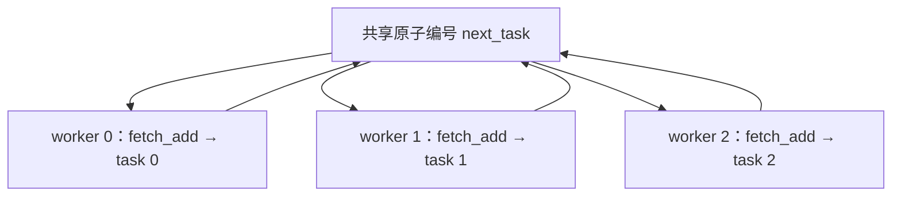
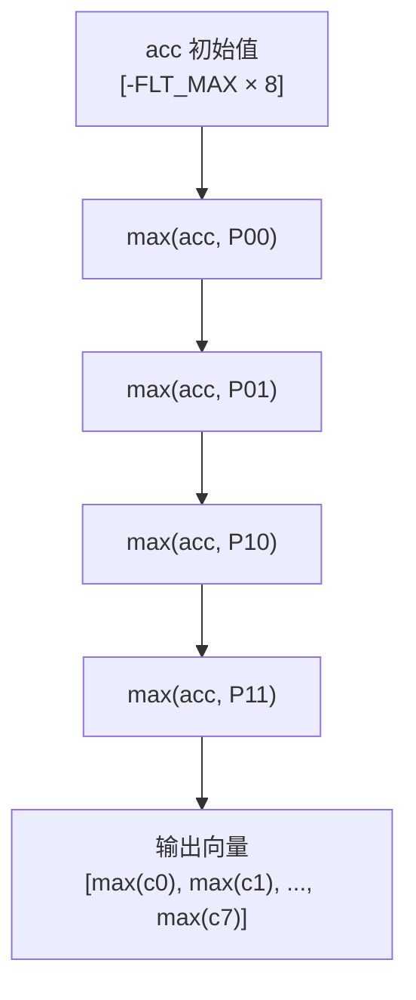

# NCHW pooling: reference vs optimized JIT-style implementation

This directory contains standalone educational implementations of forward 2D pooling for `float` NCHW tensors:

- [ref_pooling.cpp](ref_pooling.cpp): scalar reference implementation.
- [jit_pooling.cpp](jit_pooling.cpp): AVX2-specialized, JIT-style kernel pipeline with a scalar fallback.
- [pooling_test.cpp](pooling_test.cpp): compares reference and optimized results for max and average pooling.

`jit_pooling.cpp` is **not linked to oneDNN/Xbyak**. It expresses the same execution strategy in portable C++ plus AVX2 intrinsics. In OpenVINO, the analogous machine instructions are emitted by Xbyak in `jit_uni_pool_kernel` at primitive initialization time.

## Optimizations used by the optimized implementation

1. **Channel SIMD** — converts one NCHW channel block into `[H][W][8]` scratchpad storage, then applies one AVX2 vector instruction to 8 channels.
2. **ISA dispatch** — checks AVX2 at runtime; otherwise calls the scalar reference kernel.
3. **Output-width unrolling** — computes up to four `ow` positions in one kernel call, with independent vector accumulators.
4. **Padding specialization** — dispatches each output-width tile to either a branch-free interior kernel or a boundary kernel.
5. **NCHW-to-blocked conversion** — converts only one `(n, channel-block)` slice rather than materializing a complete blocked tensor.
6. **Thread-private scratchpads** — every worker owns a separate blocked source/destination slice.
7. **Cache-friendly work partitioning** — atomic work-stealing distributes `(n, channel-block)` tasks, so each worker reuses the converted source slice for all output rows.
8. **Average-pooling reciprocal reuse** — the interior region broadcasts `1 / (KH * KW)` once per tile and uses vector multiplication instead of per-element division.
9. **Masked channel tail** — the final incomplete channel block is padded on input and written back using only the valid lanes.

The illustrative optimized path supports `max`, `avg_include_padding`, and `avg_exclude_padding`. Max-pooling workspace indices remain an extension point.

## Compile example

```sh
g++ -std=c++17 -O3 -Wall -Wextra -pthread -c ref_pooling.cpp jit_pooling.cpp
g++ -std=c++17 -O3 -Wall -Wextra -pthread ref_pooling.cpp jit_pooling.cpp pooling_test.cpp -o pooling_test
./pooling_test
```

No global `-mavx2` is required on GCC/Clang: the AVX2 functions are marked with a per-function target attribute. Calling the optimized function on a CPU without AVX2 safely falls back to the reference path.

每个 worker 不按输出行或空间 tile 切分，而是按：

$$
\boxed{task=(n,\ cb)}
$$

切分，其中：

- $n$：batch 维度中的一个样本；
- $cb$：一个连续的 8-channel block 编号。

相关代码在 jit_pooling.cpp。

---

## 1. 一共有多少个 task

```cpp
const int channel_block_num = (d.c + channel_block - 1) / channel_block;
const int task_count = d.n * channel_block_num;
```

见 jit_pooling.cpp。

由于：

$$
channel\_block=8
$$

所以每个样本的 channel block 数量是：

$$
CB=\left\lceil\frac{C}{8}\right\rceil
$$

总任务数是：

$$
task\_count=N\times CB
$$

例如：

$$
N=2,\quad C=20
$$

则：

$$
CB=\left\lceil20/8\right\rceil=3
$$

总任务数：

$$
task\_count=2\times3=6
$$

任务编号和实际数据块的映射：

| `task` | $n$ | $cb$ | 处理的 channel |
|---:|---:|---:|---|
| 0 | 0 | 0 | $c_0\sim c_7$ |
| 1 | 0 | 1 | $c_8\sim c_{15}$ |
| 2 | 0 | 2 | $c_{16}\sim c_{19}$，其余 lane 补零 |
| 3 | 1 | 0 | $c_0\sim c_7$ |
| 4 | 1 | 1 | $c_8\sim c_{15}$ |
| 5 | 1 | 2 | $c_{16}\sim c_{19}$，其余 lane 补零 |

---

## 2. worker 如何领取 task

所有 worker 共享一个原子计数器：

```cpp
std::atomic<int> next_task {0};
```

见 jit_pooling.cpp。

每次通过：

```cpp
next_task.fetch_add(1)
```

原子地领取一个不同的 task 编号。核心循环是：

```cpp
for (int task = next_task.fetch_add(1);
     task < task_count;
     task = next_task.fetch_add(1)) {
```

见 jit_pooling.cpp。

`fetch_add(1)` 的语义是：

1. 返回当前值；
2. 将共享计数器加一；
3. 这个操作不可分割，因此不会有两个 worker 获得同一个 task。

因此即使 worker 并发执行，也会得到互不重复的编号：

```text
worker A → task 0
worker B → task 1
worker C → task 2
worker A → task 3
worker C → task 4
...
```

编号的领取顺序不固定，由哪个核心先完成上一任务决定。

---

## 3. task 编号如何还原为 $(n,cb)$

```cpp
const int n = task / channel_block_num;
const int cb = task % channel_block_num;
```

见 jit_pooling.cpp。

它等价于：

$$
task=n\times CB+cb
$$

因此反解为：

$$
n=\left\lfloor\frac{task}{CB}\right\rfloor
$$

$$
cb=task\bmod CB
$$

例如 $CB=3$、`task = 5`：

$$
n=\lfloor5/3\rfloor=1
$$

$$
cb=5\bmod3=2
$$

即处理 batch 1 的第三个 channel block。

---

## 4. 一个 task 内部做完整的 channel-block pooling

worker 领取 `(n, cb)` 后，会执行三个阶段：

```cpp
nchw_to_nhwc8(src, src_scratch.data(), n, cb, d);
pooling_block_avx2(src_scratch.data(), dst_scratch.data(), d);
nhwc8_to_nchw(dst_scratch.data(), dst, n, cb, d);
```

见 jit_pooling.cpp。

流程是：



注意：一个 task 会完成该 `(n,cb)` 对应的 **整个输出平面**：

$$
OH\times OW\times 8
$$

而不是只计算一个输出像素或一行。

---

## 5. 为什么这样切分没有数据竞争

不同的 task 一定不同：

$$
(n,cb)\ne(n',cb')
$$

若 $n$ 不同，读写的是不同 batch 样本。

若 $cb$ 不同，读写的是不同 channel 范围：

$$
[8cb,\ 8cb+7]
$$

所以不同 worker 写入的 NCHW 输出元素不重叠。

每个 worker 还持有自己的：

- `src_scratch`
- `dst_scratch`

它们在 worker lambda 内创建，见 jit_pooling.cpp，不与其他线程共享。

因此：

- 输入 `src`：只读，可安全共享；
- 输出 `dst`：每个任务写不同的 channel block，可安全并行；
- scratchpad：线程私有，无竞争。

---

## 6. 这是动态任务调度，而非静态均分

实现没有预先规定“worker 0 永远负责任务 0～3”。相反，它采用动态领取：



谁先完成当前 `(n, cb)` 的处理，谁就先领取下一个 task。

优点：

- 避免因尾部 block、系统调度或不同核心状态造成 worker 空闲；
- 多个任务较多时，负载通常更均衡；
- 线程本地 scratchpad 会被重复使用，不必每个 task 重新分配。

但它有一个边界：

$$
task\_count=N\times\left\lceil\frac{C}{8}\right\rceil
$$

如果这个值很小，例如 $N=1,C=8$，就只有一个 task，即使机器有很多核，也只能由一个 worker 实际执行计算。

每个 channel block 包含连续的 8 个 channel：

$$
cb \Rightarrow [c_0,c_1,\ldots,c_7]
$$

其中：

$$
c_i=8\times cb+i
$$

它负责计算这个 8-channel block 在一个 batch 样本中的**全部输出空间位置**：

$$
[OH][OW][8]
$$

---

## 1. 先把当前 8 个 channel 转为 `[IH][IW][8]`

任务 `(n, cb)` 开始后，首先调用 `nchw_to_nhwc8()`，见 jit_pooling.cpp。

原始 NCHW 的同一像素不同通道不连续：

```text
src[n][c0][h][w]
src[n][c1][h][w]
...
src[n][c7][h][w]
```

转换到 `src_scratch` 后，同一空间坐标的 8 个 channel 连续：

```text
src_scratch[h][w] =
[c0(h,w), c1(h,w), c2(h,w), c3(h,w),
 c4(h,w), c5(h,w), c6(h,w), c7(h,w)]
```

具体写入逻辑在 jit_pooling.cpp。

于是一次 256-bit AVX2 加载：

```cpp
const __m256 input = _mm256_loadu_ps(
    src + (ih * d.iw + iw) * channel_block);
```

得到的不是一个 channel 的 8 个空间元素，而是：

$$
input=
[
x_{c_0,ih,iw},\
x_{c_1,ih,iw},\
\ldots,\
x_{c_7,ih,iw}
]
$$

即，**一个 lane 对应一个 channel**。

---

## 2. 一个输出位置对应一个 AVX2 累加器

假设当前计算输出：

$$
dst[n,\ c_0:c_7,\ oh,\ ow]
$$

其窗口左上角为：

$$
ih_0=oh\times stride_h-pad_t
$$

$$
iw_0=ow\times stride_w-pad_l
$$

则初始化向量累加器 `acc`：

```cpp
__m256 acc = ...;
```

- max pooling 初始化为最小 float：

$$
acc=[
-\mathrm{FLT\_MAX},
-\mathrm{FLT\_MAX},
\ldots,
-\mathrm{FLT\_MAX}
]
$$

- average pooling 初始化为零：

$$
acc=[0,0,\ldots,0]
$$

对应 jit_pooling.cpp，边界路径也有同样逻辑：jit_pooling.cpp。

---

## 3. 遍历空间窗口，但每次同时更新 8 个 channel

对于每一个合法窗口坐标：

$$
(ih,iw)=(ih_0+kh,\ iw_0+kw)
$$

先加载：

$$
input=
[
x_{c_0,ih,iw},
x_{c_1,ih,iw},
\ldots,
x_{c_7,ih,iw}
]
$$

然后依照 pooling 类型更新。

### Max pooling

代码使用：

```cpp
acc = _mm256_max_ps(acc, input);
```

见 jit_pooling.cpp。

逐 lane 的含义是：

$$
acc_i\leftarrow\max(acc_i,\ x_{c_i,ih,iw})
$$

窗口完成后：

$$
acc=
[
\max_{\text{window}}x_{c_0},
\max_{\text{window}}x_{c_1},
\ldots,
\max_{\text{window}}x_{c_7}
]
$$

注意，这里**没有横向 max**。因为 lane 之间是不同 channel，不能相互比较。

---

### Average pooling

代码使用：

```cpp
acc = _mm256_add_ps(acc, input);
```

同在 jit_pooling.cpp。

逐 lane：

$$
acc_i\leftarrow acc_i+x_{c_i,ih,iw}
$$

遍历完窗口后：

$$
acc=
[
\sum_{\text{window}}x_{c_0},
\sum_{\text{window}}x_{c_1},
\ldots,
\sum_{\text{window}}x_{c_7}
]
$$

最后把同一个除数广播到所有 lane，再相乘：

```cpp
const __m256 reciprocal = _mm256_set1_ps(1.0F / divisor);
acc = _mm256_mul_ps(acc, reciprocal);
```

见 jit_pooling.cpp。

因此：

$$
acc_i\leftarrow acc_i\times\frac{1}{divisor}
$$

- `avg_include_padding`：

$$
divisor=KH\times KW
$$

- `avg_exclude_padding`：边界路径会统计有效窗口元素数 `valid_elements`，并使用：

$$
divisor=\text{valid\_elements}
$$

见 jit_pooling.cpp。

---

## 4. 以 $2\times2$ max pooling 为例

假设当前 block 为 `cb = 0`，即 channel $0\sim7$；stride 为 2，计算输出 $(oh,ow)$。

窗口的 4 个输入向量为：

$$
\begin{aligned}
P_{00}&=[c_0^{00},c_1^{00},\ldots,c_7^{00}]\\
P_{01}&=[c_0^{01},c_1^{01},\ldots,c_7^{01}]\\
P_{10}&=[c_0^{10},c_1^{10},\ldots,c_7^{10}]\\
P_{11}&=[c_0^{11},c_1^{11},\ldots,c_7^{11}]
\end{aligned}
$$

数据流如下：



最终：

$$
dst[n,c_i,oh,ow]
=
\max
\left(
c_i^{00},c_i^{01},c_i^{10},c_i^{11}
\right)
$$

对 $i=0\ldots7$ 同时完成。

---

## 5. `output_width_unroll = 4` 进一步并行

实际内部 kernel 不只计算一个输出位置。它最多维护：

```cpp
__m256 acc[4];
```

见 [llm/pooling/jit_pooling.cpp](llm/pooling/jit_pooling.cpp#L111)。

含义：

```text
acc[0] → 输出 (oh, ow)
acc[1] → 输出 (oh, ow + 1)
acc[2] → 输出 (oh, ow + 2)
acc[3] → 输出 (oh, ow + 3)
```

每个 `acc[u]` 都有 8 个 lane，对应当前 block 的 8 个 channel。

因此一个 tile 最多并行产生：

$$
4\text{ 个 output position}\times8\text{ 个 channel}
=32\text{ 个输出元素}
$$

其空间/通道对应关系为：

```text
                  c0  c1  c2  c3  c4  c5  c6  c7
acc[0] / ow     :  ✓   ✓   ✓   ✓   ✓   ✓   ✓   ✓
acc[1] / ow + 1 :  ✓   ✓   ✓   ✓   ✓   ✓   ✓   ✓
acc[2] / ow + 2 :  ✓   ✓   ✓   ✓   ✓   ✓   ✓   ✓
acc[3] / ow + 3 :  ✓   ✓   ✓   ✓   ✓   ✓   ✓   ✓
```

窗口循环中，每读取一个 `(kh, kw)`，都会更新所有有效的 `acc[u]`，见 [llm/pooling/jit_pooling.cpp](llm/pooling/jit_pooling.cpp#L121-L127)。

---

## 6. 最后写回 NCHW

向量计算结果先写入 `dst_scratch` 的 `[OH][OW][8]`：

```cpp
_mm256_storeu_ps(..., acc[u]);
```

见 [llm/pooling/jit_pooling.cpp](llm/pooling/jit_pooling.cpp#L138-L141)。

随后 `nhwc8_to_nchw()` 将其拆回原始 NCHW 的各 channel：

$$
dst\_scratch[oh][ow][i]
\rightarrow
dst[n][8\times cb+i][oh][ow]
$$

见 [llm/pooling/jit_pooling.cpp](llm/pooling/jit_pooling.cpp#L99-L106)。

如果 $C$ 不是 8 的倍数，最后一个 block 的多余 lane 虽然仍参与 SIMD 计算，但输出转换只回写真实的 channel，避免写入无效结果。