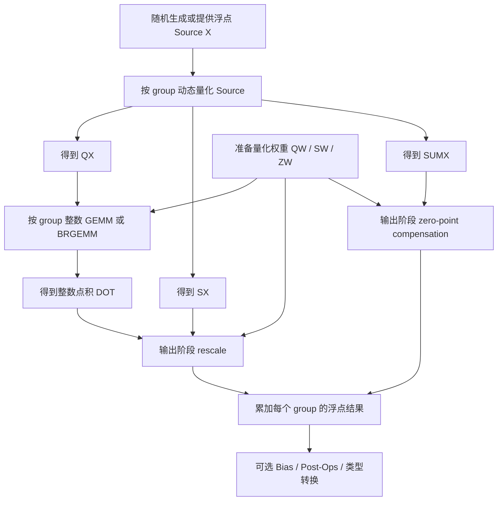

# Source Dynamic Quantization (S-DQ) 原理详解

本文解释一种常见的 `source dynamic quantization` 计算流，目标是把输入激活在运行时按组动态量化，再与离线准备好的量化权重做整数矩阵乘，最后在输出阶段统一完成还原与补偿。

这里重点解释的不是“如何把一个张量变成 int8”，而是整条计算链路：

1. 运行时对 source 做按组动态量化。
2. 预先准备量化权重与其元数据。
3. 做整数 BRGEMM / GEMM。
4. 在输出阶段完成 rescale 和 weight zero-point compensation。

## 1. 问题背景

设输入激活为：

$$
X \in \mathbb{R}^{M \times K}
$$

设权重不是直接存浮点，而是量化后存储。为了学习方便，本文统一把量化后的逻辑整数值记成：

$$
Q_W \in \mathbb{Z}^{K \times N}
$$

这里 `Q_W` 可以来自多种存储格式：

- `u8`：逻辑值范围 `[0, 255]`
- `i8`：逻辑值范围 `[-128, 127]`，本文示例里使用 `[-127, 127]`
- `u4`：逻辑值范围 `[0, 15]`
- `i4`：逻辑值范围 `[-8, 7]`

注意：在工程实现里，`u4/i4` 往往是 pack 在字节中的。本文现在把这两层都展示出来：

- 第一层：逻辑值层，强调数学公式
- 第二层：真实 nibble pack/unpack 层，强调工程存储细节

其中最常见的打包方式是：一个字节里存两个 4-bit 值。

- 低 4 bit 存第 `2i` 个值
- 高 4 bit 存第 `2i+1` 个值

如果是 `u4`，读出来后逻辑值范围就是 `[0, 15]`。

如果是 `i4`，读出来后要做符号扩展：

$$
v_{i4} =
\begin{cases}
n, & n < 8 \\
n - 16, & n \ge 8
\end{cases}
$$

这里 `n` 是 nibble 的无符号原始值 `[0, 15]`。

并且带有按 group、按输出通道的权重尺度与零点：

$$
S_W[g, n], \quad Z_W[g, n]
$$

其中 `g` 表示 K 维上的某个 group。

于是浮点权重可表示为：

$$
W[k, n] = (Q_W[k, n] - Z_W[g, n]) \cdot S_W[g, n]
$$

这里的 `g = \lfloor k / groupSize \rfloor`。

目标输出为：

$$
Y[m, n] = \sum_{k=0}^{K-1} X[m, k] \cdot W[k, n]
$$

如果直接做浮点乘法，代价较高。S-DQ 的做法是：在运行时把 `X` 也量化，再把大部分乘加变成整数计算。

## 2. 核心思想

S-DQ 的关键不是只做一件事，而是做三件事：

1. 对 `source` 按 group 动态量化，得到 `Q_X`。
2. 同时记录每组的 `source scale`。
3. 同时记录每组的 `source grouped sum`，供后续 zero-point compensation 使用。

于是，对每个 `(m, g)`，我们得到：

- `Q_X[m, k]`：量化后的输入
- `S_X[m, g]`：该组的动态尺度
- `SUM_X[m, g]`：该组量化值的和

## 2.1 学习时最重要的 4 个分界

为了更容易理解，建议把整条 S-DQ 路径强行拆成 4 个边界清晰的阶段：

### A. Source Side

只负责输入激活：

- 输入：浮点 `X`
- 输出：`Q_X`, `S_X`, `SUM_X`

这一阶段不关心权重，也不关心 BRGEMM。

### B. Weight Side

只负责权重：

- 输入：量化权重存储
- 输出：逻辑权重整数值 `Q_W`、权重尺度 `S_W`、权重零点 `Z_W`

这一阶段不关心 source 是怎么量化出来的。

### C. Integer Core

只负责整数主乘加：

$$
DOT = Q_X \cdot Q_W
$$

这一阶段只做整数域乘加，不做浮点还原，也不做补偿。

### D. Finalize Side

只负责把整数结果恢复为真实浮点语义：

- 用 `S_X * S_W` 做 rescale
- 用 `SUM_X * Z_W` 做 compensation
- 可选加 bias / post-ops / 类型转换

如果先把这 4 个边界建立起来，再回头看工程代码，会清晰很多。

## 3. Source 量化公式

对某一行 `m` 和某一组 `g`，记该组覆盖的 K 维索引集合为 `G_g`。

### 3.1 计算动态尺度

先找这一组的绝对值最大值：

$$
A_{m,g} = \max_{k \in G_g} |X[m, k]|
$$

然后定义：

$$
S_X[m, g] = \frac{A_{m,g}}{127}
$$

如果整组都是 0，则令 `S_X[m, g] = 0`，对应量化结果也全部为 0。

### 3.2 量化 source

对组内每个元素：

$$
Q_X[m, k] = \operatorname{clip}_{[-127,127]}
\left(
\operatorname{round}\left(\frac{X[m, k]}{S_X[m, g]}\right)
\right)
$$

于是近似关系为：

$$
X[m, k] \approx Q_X[m, k] \cdot S_X[m, g]
$$

### 3.3 计算 grouped sum

对这一组再计算：

$$
SUM_X[m, g] = \sum_{k \in G_g} Q_X[m, k]
$$

这个量在后面的补偿项里非常关键。

## 4. 权重量化表示

假设权重已经按组准备好了量化值、尺度和零点。对任意 `k, n`：

$$
W[k, n] = (Q_W[k, n] - Z_W[g, n]) \cdot S_W[g, n]
$$

代回原始浮点计算：

$$
Y[m, n] = \sum_g \sum_{k \in G_g} X[m, k] \cdot (Q_W[k, n] - Z_W[g, n]) \cdot S_W[g, n]
$$

再用 `X[m, k] \approx Q_X[m, k] \cdot S_X[m, g]` 近似：

$$
Y[m, n] \approx \sum_g \sum_{k \in G_g} Q_X[m, k] \cdot (Q_W[k, n] - Z_W[g, n]) \cdot S_X[m, g] \cdot S_W[g, n]
$$

## 5. 为什么需要 compensation

把上式展开：

$$
Y[m, n] \approx \sum_g
\left(
\sum_{k \in G_g} Q_X[m, k] \cdot Q_W[k, n]
\right)
\cdot S_X[m, g] \cdot S_W[g, n]
-
\sum_g
\left(
\sum_{k \in G_g} Q_X[m, k]
\right)
\cdot Z_W[g, n] \cdot S_X[m, g] \cdot S_W[g, n]
$$

定义整数点积：

$$
DOT[m, g, n] = \sum_{k \in G_g} Q_X[m, k] \cdot Q_W[k, n]
$$

于是可写成：

$$
Y[m, n] \approx \sum_g
\left(
DOT[m, g, n] \cdot S_X[m, g] \cdot S_W[g, n]
-
SUM_X[m, g] \cdot Z_W[g, n] \cdot S_X[m, g] \cdot S_W[g, n]
\right)
$$

第二项就是通常说的 `weight zero-point compensation`。

### 直观理解

如果权重零点不是 0，那么 `Q_W` 不是“围绕真正零值居中”的整数值，而是整体带偏移。

因此单纯计算：

$$
Q_X \cdot Q_W
$$

会多出一个由 `Z_W` 引入的系统偏移。这个偏移恰好可以写成：

$$
SUM_X \cdot Z_W
$$

所以只要提前准备了 `SUM_X`，就能在输出阶段一次性减掉这部分偏差。

## 6. 整条执行流

更细一点，按实现顺序看：

1. 确定 `M, K, N` 和 `groupSize`。
2. 预处理权重：准备 `Q_W`, `S_W`, `Z_W`。
3. 对每个 `m`、每个 `g`：
   - 计算 `S_X[m, g]`
   - 计算 `Q_X[m, k]`
   - 计算 `SUM_X[m, g]`
4. 对每个 `m, g, n` 做整数点积 `DOT[m, g, n]`。
5. 对每个 `m, g, n` 做：
   - `scale = S_X[m, g] * S_W[g, n]`
   - `comp = SUM_X[m, g] * Z_W[g, n] * scale`
   - `Y += DOT * scale - comp`
6. 对最终输出加 bias，或继续做其它后处理。

## 6.1 针对 `u8/i8/u4/i4` 的理解分界

这 4 种权重格式里，真正变化的主要是 Weight Side，而不是 Source Side。

### Source Side 不变

不管权重是 `u8/i8/u4/i4`，source 都还是：

- 运行时按组找 `amax`
- 生成 `S_X`
- 生成 `Q_X`
- 生成 `SUM_X`

也就是说，source DQ 的流程本身和权重位宽没有直接耦合。

### Weight Side 有变化

权重格式不同，主要体现在 `Q_W` 的逻辑取值范围：

- `u8`: `Q_W \in [0,255]`
- `i8`: `Q_W \in [-127,127]`
- `u4`: `Q_W \in [0,15]`
- `i4`: `Q_W \in [-8,7]`

如果进一步进入真实工程存储层，`u4/i4` 还有一层 pack/unpack：

- 存储层：`packed_bytes`
- 逻辑层：`Q_W`

也就是说，`u4/i4` 比 `u8/i8` 多了一步：

$$
packed\ bytes \rightarrow unpack \rightarrow Q_W
$$

而 `u8/i8` 通常可以近似理解为：

$$
stored\ bytes \equiv Q_W
$$

但只要最终能恢复出“逻辑整数值” `Q_W`，后面的整数点积和 compensation 公式并不会变。

### Integer Core 不变

无论 `Q_W` 源自 `u8/i8/u4/i4`，主计算的数学形式都还是：

$$
DOT[m,g,n] = \sum_{k \in G_g} Q_X[m,k] \cdot Q_W[k,n]
$$

### Finalize Side 不变

无论权重来自 `u8/i8/u4/i4`，最后都还是：

$$
Y += DOT \cdot (S_X \cdot S_W) - SUM_X \cdot Z_W \cdot (S_X \cdot S_W)
$$

所以从学习角度说：

- `u8/i8/u4/i4` 的主要差异在“权重如何表示和读取”
- S-DQ 的核心差异在“source 动态量化 + grouped sum + finalize compensation”

## 6.2 `u4/i4` 的真实 nibble pack/unpack 分界

为了避免把数学和存储揉在一起，建议把 `u4/i4` 再拆成两个子层：

### Weight Storage Layer

只负责字节打包：

- `logical_qw[2i]` 放到 byte 的低 4 bit
- `logical_qw[2i+1]` 放到 byte 的高 4 bit

这一步不涉及 scale、zero-point，也不涉及 source。

### Weight Logical Layer

只负责把 packed byte 还原成逻辑整数权重值 `Q_W`：

- `u4`：直接取 nibble 值
- `i4`：取 nibble 后做符号扩展到 `[-8, 7]`

完成这一步之后，后续 S-DQ 数学流程就和 `u8/i8` 一样了。

这也是工程里非常重要的分界：

- pack/unpack 解决的是“怎么存”
- S-DQ 解决的是“怎么算”

## 7. 快路径与慢路径

在工程实现中，经常会有两种路径：

### 7.1 快路径

- source 在运行时量化成 int8
- 权重保持整数格式
- 主计算使用整数 BRGEMM / GEMM
- 输出阶段再做 rescale 和 compensation

优点：

- 大部分乘加在整数域完成
- 更容易利用 VNNI / AMX / BRGEMM 类硬件能力

### 7.2 慢路径

- source 仍然量化
- 但权重先解回浮点
- 主计算退化成标量或普通浮点路径

优点：

- 更通用
- 对形状和 kernel 限制更少

差别在于：

- 快路径里 compensation 通常是显式的
- 慢路径里 compensation 往往已经隐含在权重解压公式里

## 8. 这条路径与普通浮点 MatMul 的最大区别

普通浮点路径通常是：

$$
Y = X \cdot W
$$

S-DQ 路径则变成：

1. `X` 运行时量化为 `Q_X`
2. 保留 `S_X`
3. 保留 `SUM_X`
4. 做整数点积 `Q_X \cdot Q_W`
5. 在输出阶段统一恢复浮点语义

所以更准确的说法不是“BRGEMM 后做一个额外补偿”，而是：

- 先把 source 量化
- 再做整数点积
- 最后在输出阶段统一做浮点还原与补偿

补偿只是最后一步的一部分，但它是有 zero-point 时不可缺少的一部分。

## 9. 数值误差从哪里来

S-DQ 的误差主要来源于 source 量化：

$$
X \approx Q_X \cdot S_X
$$

这一步是有舍入误差的，因此最终输出与纯浮点参考实现不完全一致。但如果 groupSize 合理、数据分布正常，误差通常会比较小。

典型规律：

- groupSize 越小，source 量化通常越精确
- groupSize 越大，scale 共享范围越大，误差可能增大
- source 分布越尖锐，量化误差越容易放大

## 10. 本目录示例代码说明

本目录额外提供两份 standalone 示例：

- `sdq_torch.py`
- `sdq_standalone.cpp`

两份代码都会：

1. 用随机数生成 source
2. 用随机数生成 `u8/i8/u4/i4` 四种权重，并对 `u4/i4` 额外展示真实 nibble pack/unpack
3. 给出浮点参考结果
4. 给出 S-DQ 结果
5. 对比误差

并且代码结构会显式切成 4 块：

- Source Side
- Weight Side
- Integer Core
- Finalize Side

这样可以直接从公式过渡到可运行实现。

## 11. 一句话总结

S-DQ 的本质是：

- 运行时把 source 按组量化成 int8
- 预存量化权重
- 用整数 GEMM / BRGEMM 做主乘加
- 用 source scale、weight scale 和 grouped sum 在输出阶段恢复真实浮点语义，并消除 weight zero-point 带来的偏移

公式化地说：

$$
Y[m, n] \approx \sum_g
\left(
DOT[m, g, n] \cdot S_X[m, g] \cdot S_W[g, n]
-
SUM_X[m, g] \cdot Z_W[g, n] \cdot S_X[m, g] \cdot S_W[g, n]
\right)
$$
