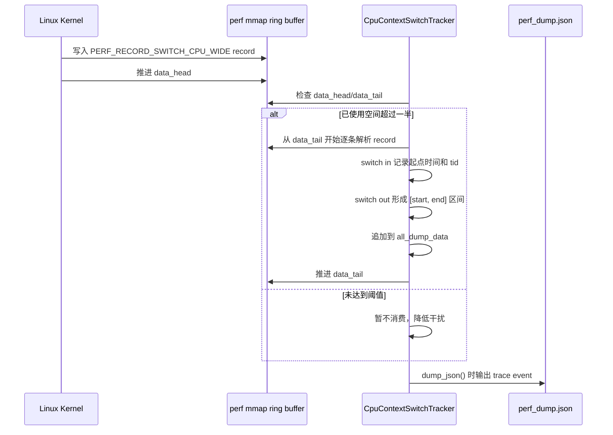

# linux_perf_advance.hpp 教学版说明

这份文档面向第一次接触 `linux_perf_advance.hpp` 的读者，目标是解释三件事：

1. 这份代码解决什么问题。
2. 它背后的 Linux perf 原理是什么。
3. 你应该怎么在自己的代码里使用它。

配套示例见 [sample_profile.cpp](/home/xiuchuan/xiuchuan/workspace/ddzz/tools/profile_advance/sample_profile.cpp)。

## 1. 这份头文件做了什么

`linux_perf_advance.hpp` 是一个 header-only 的轻量 profiler 封装，它把 Linux `perf_event_open` 这套底层接口包装成了更容易直接嵌入业务代码的 C++ API。

它主要提供两类能力：

1. 统计一个作用域内的 PMU / software counter。
2. 在开启 dump 模式时，把 profiling 结果导出成 trace JSON，便于在 Chrome Trace / Perfetto 一类工具里看时间线。

最常用的使用方式就是：

```cpp
auto scope = LinuxPerf::Profile("my_kernel");
do_work();
scope.finish();
```

如果你什么都不额外配置，它默认会为当前线程建立一组常用事件：

1. `HW_CPU_CYCLES`
2. `HW_INSTRUCTIONS`
3. `HW_CACHE_MISSES`
4. `SW_CONTEXT_SWITCHES`
5. `SW_TASK_CLOCK`
6. `SW_PAGE_FAULTS`

这意味着你在一个作用域结束后，既可以看纯硬件计数器，也可以看任务时钟、缺页、上下文切换这类软件事件。

## 2. 架构总览

整个库围绕四个核心组件构建，各自职责清晰：

```text
┌─────────────────────────────────────────────────────────────────┐
│                        LINUX_PERF env var                       │
│              dump:switch-cpu:L2_MISS=0x10d1:cpus=56             │
└──────────────────────────┬──────────────────────────────────────┘
                           │ 解析
                           ▼
              ┌────────────────────────┐
              │  1. PerfConfig  │  全局单例，解析环境变量
              │    (配置解析)           │  决定开哪些事件、是否 dump
              └────────────┬───────────┘
                           │ 驱动
              ┌────────────┴───────────────────────┐
              │                                    │
              ▼                                    ▼
┌──────────────────────────┐       ┌───────────────────────────────┐
│  2. PerfCounterGroup   │       │  3. CpuContextSwitchTracker   │
│  (per-thread 计数器)     │       │  (per-CPU 调度时间线)         │
│                          │       │                               │
│  - HW/SW/RAW 事件组      │       │  - CPU-wide context_switch    │
│  - rdpmc 快路径          │       │  - ring buffer 消费           │
│  - ProfileScope RAII     │       │  - switch in/out 状态机       │
│  - thread_local 单例     │       │  - 全局单例                   │
└────────────┬─────────────┘       └───────────────┬───────────────┘
             │ 实现 ITraceEventDumper               │
             └────────────┬────────────────────────┘
                          │ 注册 & dump
                          ▼
              ┌────────────────────────┐
              │  4. TraceFileWriter    │  进程级单例（跨 .so）
              │ (JSON trace 汇聚输出)  │  Chrome Trace Format
              │                        │  → perf_dump.json
              └────────────────────────┘
```

### 关键设计决策

| 决策 | 原因 |
|---|---|
| **跨 .so 共享内存单例** (`CrossLibrarySingleton`) | JSON dumper 必须全进程唯一，即使 header 被编译进多个 `.so`。通过 POSIX `shm_open` + 原子自旋锁协调。 |
| **`CLOCK_MONOTONIC_RAW` 作为统一时间基准** | 避免 TSC 校准需要的 ~1s 等待，且和 `perf_event_attr` 里的 clockid 保持一致。 |
| **`rdpmc` 快路径** | 内核通过 mmap page 暴露 PMC index 时，计数器在用户态直接读取，零系统调用——对微基准测量至关重要。 |
| **采样概率控制** | `Profile(0.1f, "name")` 通过全局原子锁随机禁用 90% 的嵌套 profiling，降低热路径开销。 |
| **C API 桥接** | `#ifdef LINUX_PERF_C_API` 暴露 `linux_perf_profile_start/end`，将 C++ `ProfileScope` 包装为 `void*`，供纯 C 代码使用。 |

### 典型使用流程

```bash
LINUX_PERF=dump:switch-cpu ./my_app
```

1. `PerfConfig::get()` 解析环境变量。
2. `CpuContextSwitchTracker::get()` 为每个目标 CPU 打开 context switch 事件。
3. 每个工作线程首次调用 `Profile(...)` 时创建 `thread_local PerfCounterGroup`。
4. RAII `ProfileScope` 在作用域内捕获计数器差值。
5. 进程退出时，析构链触发 `TraceFileWriter::flush_and_close()` → 写出 `perf_dump.json`。
6. 用 `chrome://tracing` 或 Perfetto 打开，即可看到时间线 + 计数器分析。

## 3. 底层原理

### 2.1 perf_event_open

Linux 内核提供了 `perf_event_open` 系统调用。你给它一个 `perf_event_attr` 结构，它就会帮你创建一个 perf event 文件描述符。

不同的 `type/config` 组合代表不同的事件类型：

1. `PERF_TYPE_HARDWARE` 对应硬件计数器，比如 cycles、instructions。
2. `PERF_TYPE_SOFTWARE` 对应软件事件，比如 page faults、task clock。
3. `PERF_TYPE_RAW` 对应 CPU 原始事件编码。

这份头文件里，`PerfCounterGroup` 负责把多个 event 放进一个 group 中统一启停和读取。

### 2.2 为什么要做 event group

把多个事件放到同一个 group 有两个直接好处：

1. 可以统一 reset / enable / disable，减少测量窗口不一致。
2. 读取时可以一次拿到整组数据，再根据 event id 回填到对应槽位。

这样做能降低 “cycles 是在窗口 A 里采的，instructions 是在窗口 B 里采的” 这种偏差。

### 2.3 为什么既支持 read，又支持 rdpmc

这里有两条读取路径：

1. 常规路径：通过组读取函数从内核读取整组计数器值，本质上还是对 `group_fd` 做 `read(...)`。
2. 快速路径：如果内核允许用户态 `rdpmc`，就直接从 PMC 读，开销更低。

代码里 `PerfCounterGroup::enable()` 之后会尝试初始化 `pmc_index`。如果所有 event 都拿到了有效的 PMC index，profile scope 在开始和结束时就能直接读取 PMC，减少 profiling 自身引入的扰动。

### 2.4 为什么时间戳最后统一转成 trace 时间

内部实现使用的是单调时间源：

1. x86 上可以读 TSC。
2. aarch64 上可以读系统计数器。
3. 代码最终统一回落到 `CLOCK_MONOTONIC_RAW`，保证和内核 perf 记录使用的时间基准一致。

这样导出的 trace JSON 时间轴不会因为普通 wall clock 抖动而失真。

### 2.5 context switch 时间线是怎么来的

`CpuContextSwitchTracker` 不是统计一个普通 counter，而是为每个目标 CPU 打开 CPU-wide perf event，并用 ring buffer 接收内核写入的 `PERF_RECORD_SWITCH_CPU_WIDE` 记录。

可以把它理解成：

1. 内核不断往 mmap ring buffer 里写 “哪个线程切入 / 切出某个 CPU”。
2. 用户态周期性消费 ring buffer。
3. 最后把每段线程占用 CPU 的时间拼成 trace event。

于是 dump 出来的 JSON 不只有你自己手工打点的 profile scope，还能看到 CPU 上线程切换的背景时间线。

如果展开到实现细节，ring buffer 的使用过程大致是这样的：

1. `CpuContextSwitchTracker` 会对每个目标 CPU 调一次 `perf_event_open(&pea, -1, cpu, -1, 0)`，这里的 `pid=-1` 表示统计这个 CPU 上所有线程，属于 CPU-wide 模式。
2. 每个 fd 随后都会被 `mmap` 成一段共享内存。映射的第一页是 `perf_event_mmap_page` 元数据页，后面的 1024 页是实际的数据区，也就是 ring buffer。
3. 内核往数据区写 event record，并通过元数据页里的 `data_head` 告诉用户态“已经写到了哪里”；用户态消费完成后，把 `data_tail` 往前推进，告诉内核“这些数据我已经读完了”。

这里最关键的是 head / tail 分工：

1. `data_head` 由内核生产者推进。
2. `data_tail` 由用户态消费者推进。
3. `[data_tail, data_head)` 这段区间就是“还没被读走的记录”。

当前实现不会每来一条记录就立即解析，而是先看缓冲区是否有必要处理。`is_ring_buffer_half_full()` 会根据 `data_head - data_tail` 计算已使用空间，只有当使用量超过 ring buffer 一半时，才真正进入消费逻辑。这样做的目的是减少 profiling 过程中频繁读 ring buffer 的开销。

真正消费时，流程是：

1. 先取本次读取的起点 `head0 = data_tail`。
2. 再取终点 `head1 = data_head`。
3. 只要 `head0 < head1`，就不断解析一条 record，并把 `head0` 往后推进 `record.size`。
4. 全部解析完成后，把 `data_tail = head0`，表示这批记录已经被消费，内核可以继续覆盖后续空间。

记录解析本身没有直接把 ring buffer 当成某个固定结构数组来遍历，而是通过一个 cursor 按字段顺序读取：

1. `RingBufferReader` 持有当前 offset。
2. `read_ring_buffer<T>()` 会根据 `meta.data_offset + (offset % data_size)` 定位到 ring buffer 中的当前位置。
3. 每读取一个字段，offset 就前进对应的字节数。
4. `ContextSwitchRecord::parse()` 再把这些字段拼成一个逻辑上的 context-switch record。

这样做的意义是，ring buffer 即使在物理上已经回卷，逻辑上仍然可以用单调递增的 offset 顺序消费；真正回卷的细节由 `% data_size` 处理掉。

对于 `PERF_RECORD_SWITCH_CPU_WIDE`，当前代码主要关心两类信息：

1. 这是一次 switch in 还是 switch out，判断依据是 `misc` 里是否带 `PERF_RECORD_MISC_SWITCH_OUT` / `PERF_RECORD_MISC_SWITCH_OUT_PREEMPT`。
2. 这次切换对应的线程 id、CPU id、时间戳分别是什么。

在状态机层面，它的处理逻辑可以简化成：

1. 如果读到 switch in，就把 `switch_in_timestamp` 和 `switch_in_tid` 记下来，表示“某个线程从这个时间点开始占用该 CPU”。
2. 如果之后读到同一个 CPU 的 switch out，就用当前 record 的时间减去前面记下的 `switch_in_timestamp`，得到这段 CPU 占用区间。
3. 这段区间会被追加到 `recorded_slices`，后续统一转成 trace JSON。

为什么还要有 `flush_active_slices()` 这一步？因为在 dump JSON 的瞬间，某个 CPU 上可能还有线程正在运行，它已经有 switch in，但还没等到下一条 switch out。此时代码会用“当前时间”补一个临时结束点，确保 trace 里不会丢掉最后这段仍在运行的区间。

最后，ring buffer 的消费时机有两个：

1. 在普通 profile scope 开始时，`PerfCounterGroup::begin_scope()` 会顺手调用一次 `CpuContextSwitchTracker::drain_all_ring_buffers()`，尽量把调度背景时间线和当前采样窗口对齐。
2. 在最终写 JSON 时，`CpuContextSwitchTracker::dump_json()` 会再消费一次，确保收尾阶段残留的 switch record 也被输出。

所以，这里的 ring buffer 不是用来存业务层 profile 结果的，而是专门作为“内核调度事件到用户态 trace”的桥梁：内核负责写调度事实，用户态负责按 head/tail 协议读出来，再拼成可视化时间线。

如果你更习惯按时序去理解，可以把它看成下面这个过程：



再把 ring buffer 本身画开，会更容易理解为什么代码里只需要维护一个递增 offset：

```text
metadata page:
        data_head -> 内核已经写到哪里
        data_tail -> 用户态已经读到哪里

data pages (ring buffer):

        0 -------------------------------------------------------------- data_size
                | 已消费 |   未消费记录区间 [data_tail, data_head)   | 未来可写入区域 |
                                                                 ^ data_tail                              ^ data_head

逻辑上的读取 offset 可以一直递增；
真正落到物理 buffer 位置时，再用 (offset % data_size) 回卷。
```

这也是 `RingBufferReader` / `read_ring_buffer<T>()` 这一层存在的原因：上层代码可以把 ring buffer 当作“顺序字节流”来解析，下层再负责把逻辑 offset 映射回 mmap 环形区域中的真实地址。

## 4. 核心结构怎么读

### 4.1 PerfConfig

职责是解析环境变量 `LINUX_PERF`。

它负责三类配置：

1. `dump`：开启 JSON 导出。
2. `switch-cpu`：开启 CPU 级 context switch 时间线。
3. `XXX=...`：注册额外 raw event。

例如：

```bash
LINUX_PERF=dump:switch-cpu:L2_MISS=0x10d1
```

### 4.2 TraceFileWriter

这是最终的 trace 汇聚器。各个 dumper 会把自己注册进来，程序退出或对象析构时统一写出 `perf_dump.json`。

它解决的是两个问题：

1. 多个 profiler 实例的数据如何汇总。
2. header-only 代码被多个 so 同时使用时，如何尽量维持单例行为。

### 4.3 PerfCounterGroup

这是最核心的类。它管理一个线程内的 event group，并提供：

1. 事件添加。
2. 统一启停。
3. 读取计数器。
4. 生成 profile scope。
5. dump 成 trace JSON。

你平时直接调用的 `LinuxPerf::Profile(...)`，最终就是落到这里。

从当前实现上看，它内部大致分成这几层：

1. event group 的创建与启停。
2. 两条计数器读取路径：PMC 快路径和 group read 回退路径。
3. `begin_scope()` / `ProfileScope::finish()` 这一对作用域采样入口。
4. JSON 参数拼装与 trace event 输出。

如果只看职责划分，可以这样理解：

1. `PerfCounterGroup` 负责“当前线程这段代码消耗了多少计数器”。
2. `CpuContextSwitchTracker` 负责“这个线程什么时候真正跑在某个 CPU 上”。

也就是说，`PerfCounterGroup` 是 counter 视角，关注 cycles、instructions、cache misses、task clock 这些指标；`CpuContextSwitchTracker` 是调度视角，关注线程切入、切出、是否被抢占，以及它在某个 CPU 上持续了多久。

两者配合后的效果是：

1. 你可以从 `PerfCounterGroup` 看到某个 profile scope 的性能开销。
2. 你可以从 `CpuContextSwitchTracker` 看到这段时间内线程调度是否干扰了测量。

因此，这两个类不是重复功能，而是互补关系：一个补计数器信息，一个补时间线背景。

### 4.4 ProfileScope

这是典型的 RAII 用法：

1. 创建时记录开始时间和开始计数器。
2. 结束时记录结束时间并计算差值。
3. 析构时自动 `finish()`，避免忘记收尾。

所以最推荐的使用模式是把它定义成局部对象，让生命周期和代码块一致。

## 5. 最小使用方法

示例代码见 [sample_profile.cpp](/home/xiuchuan/xiuchuan/workspace/ddzz/tools/profile_advance/sample_profile.cpp)。

### 5.1 编译

在 `profile_advance` 目录下可以直接用：

```bash
g++ -std=c++11 -O2 -pthread sample_profile.cpp -o sample_profile -lrt
```

有些系统会把 `shm_open` / `shm_unlink` 放在 `librt` 里，所以这里显式带上 `-lrt`，这样更稳妥。

### 5.2 直接运行

```bash
./sample_profile
```

这会在标准输出里打印计算结果和几项常用计数器。

### 5.3 导出 trace JSON

```bash
LINUX_PERF=dump ./sample_profile
```

运行后会生成 `perf_dump.json`。

如果你还想把 CPU 线程切换也打进去：

```bash
LINUX_PERF=dump:switch-cpu ./sample_profile
```

### 5.4 增加 raw event

例如追加一个 raw event：

```bash
LINUX_PERF=dump:MY_EVT=0x10d1 ./sample_profile
```

或者按 `eventsel,umask,cmask` 形式写：

```bash
LINUX_PERF=dump:MY_EVT=0xd1,0x10,0x0 ./sample_profile
```

## 6. sample 在演示什么

sample 做了三件事：

1. `LinuxPerf::Init()` 提前完成默认 profiler 和 context-switch profiler 的初始化。
2. 用一个 `ProfileScope` 包住一段向量计算。
3. 调用 `finish(&counters)`，把本次作用域内的计数器结果提取到 `std::map`。

关键代码如下：

```cpp
LinuxPerf::ProfileScope scope = LinuxPerf::Profile(
        "vector_sin_update",
        std::string("teaching"),
        0,
        static_cast<int64_t>(element_count),
        rounds,
        3.1415926);
result = run_workload(data, rounds);
scope.finish(&counters);
```

这里的额外参数会进入 trace JSON 的 `Extra Data` 字段，用于辅助定位问题时记录上下文。

## 7. 使用时要注意什么

### 7.1 perf_event_open 可能失败

最常见原因是内核限制过严，比如：

1. `/proc/sys/kernel/perf_event_paranoid` 太高。
2. 当前用户没有足够权限。

如果 sample 一运行就失败，先检查：

```bash
cat /proc/sys/kernel/perf_event_paranoid
```

### 7.2 并不是所有机器都能走 rdpmc 快路径

这不是 bug。代码本来就支持回退到组读取路径，只是读数开销会更高。

### 7.3 这是”观测工具”，不是零开销工具

虽然这份代码尽量降低开销，但 profile 本身一定会引入额外扰动。所以：

1. 不要把超短小的几个指令级代码片段当成绝对精确测量对象。
2. 更适合测微秒到毫秒级的 kernel / 算法段。
3. 最好做多次采样，避免单次波动误导结论。

### 7.4 dump 模式适合分析结构，不适合无限制长跑

开启 `dump` 后，所有 profile 记录会积累到内存里，最后统一输出 JSON。长时间运行场景要注意数据量。

## 8. 什么时候该用这个工具

适合：

1. 想快速给某段 C++ 代码打点。
2. 想同时看 cycles、instructions、cache miss。
3. 想导出 trace，观察不同阶段的时间分布。
4. 想在算法开发阶段快速做局部性能比较。

不太适合：

1. 需要全系统级 perf 分析替代 `perf record` 的场景。
2. 需要非常严谨的基准框架控制变量、绑核、预热、统计显著性的场景。
3. 非 Linux 环境。

## 9. 一个实用工作流

建议按这个顺序使用：

1. 先直接用 `Profile("name")` 包住关键阶段。
2. 看标准输出里的 counters，确定是不是 CPU bound、memory bound，或者有异常 page fault / context switch。
3. 如果需要看阶段结构，再加 `LINUX_PERF=dump` 导出 trace。
4. 如果怀疑线程调度干扰，再加 `switch-cpu` 看上下文切换。
5. 如果还不够，再补 raw event。

这个顺序的好处是：先用最小成本拿到方向，再逐步加观测深度。

## 10. 底层技术详解

这一章面向想要理解代码背后原理的读者，逐一解释本库依赖的几项关键底层技术。

### 10.1 Chrome Trace Event Format

本库在 `dump` 模式下导出的 `perf_dump.json`，遵循的是 Chrome Trace Event Format。这是 Chromium 项目定义的一种 JSON 格式，可以直接在 `chrome://tracing` 或 Perfetto 中打开，渲染成可交互的时间线。

#### 10.1.1 文件整体结构

```json
{
  "schemaVersion": 1,
  "traceEvents": [
    { ... event 1 ... },
    { ... event 2 ... }
  ]
}
```

所有的 trace event 都放在 `traceEvents` 数组里。每个 event 是一个 JSON 对象。

#### 10.1.2 最常用的 event 类型

本库主要用两种 event 类型：

**1. Complete Event (`ph: "X"`)**

表示一段有明确起止时间的区间，是本库最核心的输出格式：

```json
{
  "ph": "X",
  "name": "vector_sin_update_0",
  "cat": "teaching",
  "pid": 12345,
  "tid": 12345,
  "ts": 100.5,
  "dur": 3200.1,
  "args": {
    "CPU Usage": 0.98,
    "CPU Freq(GHz)": 3.2,
    "CPI": 0.85,
    "HW_CPU_CYCLES": "10240000",
    "HW_INSTRUCTIONS": "12047058",
    "Extra Data": [0, 262144, 32, 3.1415926]
  }
}
```

字段含义：

| 字段 | 含义 |
|------|------|
| `ph` | Phase，`"X"` 表示 Complete Event（有起止时间的区间）|
| `name` | 事件名称，对应 `Profile("title")` 里传入的 title |
| `cat` | Category，对应 `Profile("title", "category")` 里的 category |
| `pid` | 进程 ID |
| `tid` | 线程 ID |
| `ts` | 起始时间，单位是微秒（相对于 `TimestampConverter` 的基准时间）|
| `dur` | 持续时间，单位是微秒 |
| `args` | 附加数据，本库用它来放计数器值和派生指标 |

在代码中，`PerfCounterGroup::write_trace_event_header()` 负责写 `ph`/`name`/`pid`/`tid`/`ts`/`dur`，`serialize_args_json()` 负责写 `args` 里的内容。

**2. Async Event (`ph: "b"` / `ph: "e"`)**

用于跨线程的异步事件，成对出现：

```json
{"ph": "b", "name": "my_flow", "cat": "async", "pid": 12345, "id": 1, "ts": 100.5},
{"ph": "e", "name": "my_flow", "cat": "async", "pid": 12345, "id": 1, "ts": 300.5, "args": {...}}
```

当 `ProfileScope` 的 `id < 0` 时，代码会输出这种格式。`id` 用于把 begin 和 end 配对。

**3. Instant Event (`ph: "i"`)**

本库在 JSON 末尾写一个 `"Profiler End"` 的 instant event，作为时间线终止标记：

```json
{"ph": "i", "name": "Profiler End", "s": "g", "pid": "Traces", "tid": "Trace OV Profiler", "ts": 5000.0}
```

`"s": "g"` 表示这是一个全局级别的瞬时标记。

#### 10.1.3 Context Switch 的 trace 格式

`CpuContextSwitchTracker` 输出的也是 Complete Event，但用法略有不同：

```json
{"ph": "X", "name": "12345", "cat": "TID", "pid": 9999, "tid": "CPU56", "ts": 100.0, "dur": 50.0}
```

这里：

1. `name` 存的是线程 ID（不是事件名），方便在时间线上直接看到是哪个线程占用了 CPU。
2. `pid` 固定为 `9999`，用作虚拟进程，把所有 CPU 时间线归为一组。
3. `tid` 存的是 `"CPU56"` 这样的字符串，表示物理 CPU 编号。

这样在 Perfetto 里打开时，你能看到每个 CPU 上的线程占用时间线，和你的 profile scope 上下对照。

#### 10.1.4 args 里的派生指标是怎么来的

`args` 中除了原始计数器值，还有几个派生指标：

| 指标 | 计算方式 | 含义 |
|------|---------|------|
| `CPU Usage` | `SW_TASK_CLOCK(ns) / duration(us) × 1e-3` | 这段时间里 CPU 实际执行的比例，接近 1.0 说明没被调度走 |
| `CPU Freq(GHz)` | `HW_CPU_CYCLES / SW_TASK_CLOCK(ns)` | 实际运行频率 |
| `CPI` | `HW_CPU_CYCLES / HW_INSTRUCTIONS` | Cycles Per Instruction，越低说明指令级并行越好 |

这些指标的计算逻辑在 `PerfCounterGroup::emit_derived_metrics()` 中。

### 10.2 Linux perf PMU：怎样工作、怎样设置、怎样读写

PMU（Performance Monitoring Unit）是 CPU 内置的硬件计数器，能在不侵入程序执行的前提下统计 cycles、instructions、cache misses 等事件。

#### 10.2.1 perf_event_open 系统调用

Linux 内核通过 `perf_event_open` 系统调用暴露 PMU 能力。调用时你传入一个 `perf_event_attr` 结构体，告诉内核你想要什么事件：

```c
int fd = perf_event_open(&attr, pid, cpu, group_fd, flags);
```

参数含义：

| 参数 | 含义 |
|------|------|
| `attr` | 事件描述，包括类型、配置、采样设置等 |
| `pid` | `0` = 当前线程，`-1` = 指定 CPU 上所有线程 |
| `cpu` | `-1` = 跟随线程跑在哪个 CPU 上 |
| `group_fd` | `-1` = 独立事件，`>=0` = 加入指定 group |
| `flags` | 通常为 0 |

返回一个文件描述符 `fd`，后续通过 `ioctl` 控制、通过 `read` 读取。

#### 10.2.2 perf_event_attr 的关键字段

本库在 `make_perf_event_attr()` 中构造这个结构体：

```c
struct perf_event_attr {
    uint32_t type;      // PERF_TYPE_HARDWARE / SOFTWARE / RAW
    uint64_t config;    // 具体事件编号
    uint32_t disabled;  // 1 = 创建后先不计数，等 ioctl ENABLE
    uint32_t exclude_kernel; // 1 = 不统计内核态
    uint32_t exclude_hv;     // 1 = 不统计 hypervisor
    uint64_t read_format;    // 读取时返回什么字段
    uint32_t pinned;         // 1 = 独占一个硬件计数器
    // ...
};
```

三种事件类型：

| type | 说明 | config 示例 |
|------|------|-------------|
| `PERF_TYPE_HARDWARE` | 内核预定义的硬件事件 | `PERF_COUNT_HW_CPU_CYCLES` |
| `PERF_TYPE_SOFTWARE` | 内核软件事件 | `PERF_COUNT_SW_TASK_CLOCK` |
| `PERF_TYPE_RAW` | CPU 原始事件编码 | `X86_RAW_EVENT(0xd1, 0x10, 0)` |

对于 Raw 事件，x86 上的编码格式遵循 Intel IA32_PERFEVTSELx 寄存器布局：

```text
bit 7:0   → EventSel（事件选择）
bit 15:8  → UMask（事件限定掩码）
bit 18    → Edge（边沿检测）
bit 23    → Inv（反转）
bit 31:24 → CMask（计数掩码）
```

代码中的 `X86_RAW_EVENT(EventSel, UMask, CMask)` 宏负责把这三个值拼成一个 config。

#### 10.2.3 Event Group：为什么要分组

把多个事件放进同一个 group 有两个好处：

1. **统一启停**：`ioctl(leader_fd, PERF_EVENT_IOC_ENABLE, PERF_IOC_FLAG_GROUP)` 一次操作就能启用整组事件，减少时间窗口不一致。
2. **统一读取**：对 group leader 的 `fd` 做一次 `read()`，就能拿到整组事件的值。

分组的原理是：第一个 `perf_event_open` 返回的 `fd` 成为 group leader，后续事件的 `group_fd` 指向这个 leader。代码中 `PerfCounterGroup::open_counter()` 实现了这个逻辑——`leader_fd` 初始为 -1，第一个事件打开后通过 `promote_to_group_leader()` 记录下来。

#### 10.2.4 Group Read 格式

当 `read_format` 包含 `PERF_FORMAT_GROUP | PERF_FORMAT_ID` 时，一次 `read(leader_fd, buf, ...)` 返回的数据布局是：

```text
┌─────────┬────────────────────┬────────────────────┬───────────┬───────────┬─────┐
│ nr (u64)│ time_enabled (u64) │ time_running (u64) │ value0    │ id0       │ ... │
│         │ (如果设置了)        │ (如果设置了)        │ (u64)     │ (u64)     │     │
└─────────┴────────────────────┴────────────────────┴───────────┴───────────┴─────┘
```

其中：
1. `nr` 是事件数量。
2. `time_enabled` / `time_running` 只在设置了对应 read_format flag 时才存在。
3. 后面是 `nr` 个 `{value, id}` 对。

代码中 `PerfCounterGroup::read_all_counters()` 按照这个布局解析 `read_buffer`，并通过 `id` 匹配回每个 `CounterDescriptor`。

#### 10.2.5 两条读取路径

本库提供两条计数器读取路径：

**慢路径：`read()` 系统调用**

```cpp
read(leader_fd, read_buffer, sizeof(read_buffer));
// 然后按上面的 Group Read 格式解析
```

优点是可靠，缺点是每次读取都要陷入内核。

**快路径：`rdpmc` 用户态指令**

当内核允许用户态直接读 PMC 时（`mmap_page->cap_user_rdpmc == 1`），可以用 `rdpmc` 指令在用户态读取计数器值，零系统调用开销。

流程是：

1. `perf_event_open` 后对 `fd` 做 `mmap`，得到 `perf_event_mmap_page`。
2. 这个 mmap page 里有 `index` 字段，表示这个事件映射到了哪个物理 PMC 寄存器。
3. 读取时直接调 `__rdpmc(index - 1)`，在 x86 上编译为 `RDPMC` 指令。

代码中的判断逻辑：

```cpp
// 初始化时
refresh_rdpmc_index(ev);  // 从 mmap page 读取 pmc_index

// 读取时
if (can_use_rdpmc()) {  // 所有事件都支持快路径
    value = read_pmc(pmc_index - 1);  // 用户态直接读
} else {
    read_all_counters();  // 回退到 read() 系统调用
}
```

有一个细节需要注意：mmap page 的 `index` 字段可能被内核随时更新（比如 CPU 迁移后），所以代码通过 seqlock 协议来保证读取的一致性：

```cpp
do {
    seqlock = pmeta->lock;
    barrier();
    pmc_index = pmeta->index;
    pmc_bit_width = pmeta->pmc_width;
    barrier();
} while (pmeta->lock != seqlock || (seqlock & 1));
```

如果 `lock` 的最低位为 1，说明内核正在更新，需要重试。

#### 10.2.6 为什么 rdpmc 的结果需要做掩码

`rdpmc` 返回的是物理 PMC 寄存器的原始值，寄存器宽度通常是 48 位（由 `pmc_width` 决定），但 `rdpmc` 返回 64 位。高位可能包含垃圾数据，所以计算差值后需要做掩码：

```cpp
delta = (read_pmc(index - 1) - start_value) & pmc_value_mask;
// pmc_value_mask = (1 << pmc_bit_width) - 1
```

这一步在 `capture_end_counters()` 中完成。

### 10.3 Ring Buffer：为什么需要、怎样运作

Ring buffer 在本库中专门用于 `CpuContextSwitchTracker`，作为内核向用户态传递调度事件的通道。

#### 10.3.1 为什么需要 Ring Buffer

对于普通的 PMU 计数器，`read()` 系统调用就够了——你在特定时间点读一次值，拿到一个数字。

但 context switch 事件不同：它是一个**事件流**——内核随时可能产生 "线程 A 在 CPU 3 上切出" 这样的记录。如果每产生一条就陷入一次系统调用通知用户态，开销太高。

Ring buffer 解决这个问题的方式是：

1. 内核把事件记录**写到共享内存**里，不需要唤醒用户态。
2. 用户态在**方便的时候**批量消费。
3. 通过 head/tail 协议协调，不需要锁。

这就像一个高效的单生产者单消费者队列。

#### 10.3.2 Ring Buffer 的内存布局

调用 `mmap(fd, page_size * (N + 1))` 时，映射出来的内存分两段：

```text
┌──────────────────────────────┐  ← mmap 起始
│  perf_event_mmap_page        │  第一页：元数据
│    data_head  (内核写)        │  内核已写到的位置
│    data_tail  (用户态写)      │  用户态已消费到的位置
│    data_offset               │  数据区相对于 mmap 起始的偏移
│    data_size                 │  数据区总大小
│    ...                       │
├──────────────────────────────┤  ← data_offset
│  ring buffer 数据区           │  后面 N 页
│  [record][record][record]... │
│  ...                         │
└──────────────────────────────┘
```

本库中 N = 1024，所以数据区大小约 4MB。

#### 10.3.3 生产者-消费者协议

```text
生产者（内核）：
  1. 把 record 写入 data_offset + (data_head % data_size) 处
  2. 写完后推进 data_head

消费者（用户态）：
  1. 读 data_head，确定有多少新数据
  2. 从 data_tail 开始逐条解析 record
  3. 解析完后推进 data_tail
```

关键点：

1. `data_head` 只由内核修改，`data_tail` 只由用户态修改，不需要互斥锁。
2. `[data_tail, data_head)` 区间就是尚未消费的记录。
3. 物理地址的回卷由 `offset % data_size` 处理——逻辑上 offset 一直递增，取模后得到物理位置。

这也是 `RingBufferReader` 存在的原因：上层代码可以像读"顺序字节流"一样解析，下层通过 `% data_size` 处理环形回卷。

#### 10.3.4 本库的消费策略

代码并不是每次有新记录就立刻消费，而是采用"半满触发"策略：

```cpp
bool is_ring_buffer_half_full() const {
    auto used = (data_head - data_tail) % data_size;
    return used > (data_size >> 1);
}
```

只有当已使用空间超过 ring buffer 一半时，才真正进入消费逻辑。这样做是为了减少 profiling 自身的开销——如果每次 `begin_scope()` 都去排空 ring buffer，对热路径的扰动太大。

消费时机有两个：

1. `PerfCounterGroup::begin_scope()` 里会调一次 `drain_all_ring_buffers()`。
2. `CpuContextSwitchTracker::dump_json()` 时会再消费一次，确保尾部数据不丢。

#### 10.3.5 PERF_RECORD_SWITCH_CPU_WIDE 的解析

从 ring buffer 中读出的每条 record 结构是：

```text
┌──────────────────────────────────────────┐
│ header:  type (u32), misc (u16), size (u16) │
├──────────────────────────────────────────┤
│ body:    next_prev_pid (u32)              │  ← 仅 SWITCH_CPU_WIDE
│          next_prev_tid (u32)              │
├──────────────────────────────────────────┤
│ sample:  pid (u32), tid (u32)             │  ← PERF_SAMPLE_TID
│          time (u64)                       │  ← PERF_SAMPLE_TIME
│          cpu (u32), reserved (u32)        │  ← PERF_SAMPLE_CPU
└──────────────────────────────────────────┘
```

代码中 `ContextSwitchRecord::parse()` 按这个顺序从 `RingBufferReader` 逐字段读取。

`misc` 字段决定了这是一次 switch in 还是 switch out：

| misc 标志位 | 含义 |
|------------|------|
| 无 `SWITCH_OUT` 标志 | switch in：线程切入 CPU |
| `PERF_RECORD_MISC_SWITCH_OUT` | switch out：线程主动让出 CPU |
| `PERF_RECORD_MISC_SWITCH_OUT_PREEMPT` | switch out：线程被抢占 |

状态机在 `parse_one_record()` 中：

```
switch in  → 记住 switch_in_timestamp 和 switch_in_tid
switch out → 用 [switch_in_timestamp, current_time] 形成一个 TimeSlice
```

### 10.4 其他关键技术点

#### 10.4.1 跨 .so 单例（CrossLibrarySingleton）

**问题**：这是一个 header-only 库。当多个 `.so` 都 include 了这个头文件时，每个 `.so` 里的 `static local` 变量是**独立的**——这意味着 `TraceFileWriter::get()` 在不同 `.so` 里会返回不同的实例，导致 JSON 输出被多个 writer 覆盖。

**解决方案**：用 POSIX 共享内存（`shm_open`）在进程范围内共享一个指针。

```text
步骤：
1. 所有 .so 中的代码调用 shm_open("/linuxperf_shm01")，拿到同一块共享内存。
2. 共享内存里存 4 个字段：
   - instance_ptr   : 指向堆上唯一的 TraceFileWriter
   - reference_count: 引用计数
   - init_lock_pid  : 用于争抢初始化权
   - init_done_pid  : 初始化完成信号

3. 第一个 CAS 成功把 init_lock_pid 设为自己 PID 的线程负责 new 对象。
4. 其他线程自旋等待 init_done_pid 被设为 PID。
5. 所有用户通过 reference_count 计数，最后一个减到 0 的负责 delete。
```

这个设计的局限是它只在同一进程内有效（`shm_open` 的命名空间是进程级的 mmap），但这恰好满足需求。

#### 10.4.2 时间基准：为什么用 CLOCK_MONOTONIC_RAW

本库在三个地方需要时间戳：

1. `ProfileScope` 的 start/end 打点。
2. `perf_event_attr` 里指定事件记录的时钟源。
3. context switch record 里内核写入的时间戳。

这三处必须用同一个时钟源，否则导出的 trace 时间线会错位。

`CLOCK_MONOTONIC_RAW` 是最佳选择：

| 时钟源 | 特点 | 问题 |
|--------|------|------|
| `CLOCK_REALTIME` | wall clock | 会被 NTP 调整，可能跳变 |
| `CLOCK_MONOTONIC` | 不跳变 | 仍受 NTP 频率修正影响 |
| `CLOCK_MONOTONIC_RAW` | 完全不受 NTP 影响 | 无 |
| TSC (`rdtsc`) | 最快，零系统调用 | 需要 ~1s 校准，多核可能不同步 |

代码中 `TimestampConverter` 用 `clock_gettime(CLOCK_MONOTONIC_RAW)` 获取纳秒级时间戳，避免了 TSC 校准的复杂性。`perf_event_attr` 里也设置 `clockid = CLOCK_MONOTONIC_RAW`，保证内核写入的 context switch 时间戳和用户态打点用的是同一个时钟。

#### 10.4.3 采样概率控制

在高频调用路径上，每次都 profile 会引入可观的开销。本库通过一个全局原子计数器实现采样概率控制：

```cpp
// 用法：只有 10% 的调用会真正 profile
auto scope = LinuxPerf::Profile(0.1f, "hot_path");
```

原理：

1. `should_skip_sample(0.1f)` 生成一个随机数，如果落在 90% 的区间里，返回 true。
2. 如果决定跳过，`suppress_nested_sampling()` 把全局 `sampling_lock` 加 1。
3. 此后所有线程的 `begin_scope()` 检查到 `sampling_lock != 0`，直接返回 nullptr。
4. 外层 scope 结束时（`ProfileScope::finish()`），如果之前加过锁，再减 1。

这意味着：当一个概率采样 scope 决定跳过时，它会**同时禁止**所有嵌套的 profile scope，防止内层 scope 在外层被跳过的情况下仍然产生开销。

#### 10.4.4 seqlock 协议（mmap page 一致性读取）

`perf_event_mmap_page` 中的 `index`（PMC 编号）、`pmc_width` 等字段可能被内核随时更新（例如线程迁移到另一个 CPU 后，PMC 映射可能变化）。内核使用 seqlock 保护这些字段：

```text
内核更新时：
  1. lock++   (变为奇数，表示正在写)
  2. 修改 index, pmc_width 等字段
  3. lock++   (变为偶数，表示写完)

用户态读取时：
  1. 记住 lock 值 seq0
  2. 读取所有字段
  3. 再读 lock 值
  4. 如果 lock != seq0 或 seq0 是奇数 → 重试
```

代码中 `refresh_rdpmc_index()` 实现了这个协议。`std::atomic_thread_fence(std::memory_order_seq_cst)` 对应 barrier，防止编译器和 CPU 重排读操作。

#### 10.4.5 C API 桥接

对于纯 C 代码（无法使用 C++ RAII），本库提供了 C 风格的 API：

```c
void* handle = linux_perf_profile_start("kernel_name", "category", 2, arg1, arg2);
// ... 执行要测量的代码 ...
linux_perf_profile_end(handle);
```

实现原理很简单：`begin_c_api_scope()` 内部创建一个 `ProfileScope` 对象并 `new` 到堆上，返回 `void*`；`linux_perf_profile_end()` 把 `void*` 转回 `ProfileScope*` 然后 `delete`——`delete` 触发析构函数，自动调用 `finish()`。

这样 C 代码也能获得和 C++ 一样的 profiling 能力，只是需要手动配对 start/end。