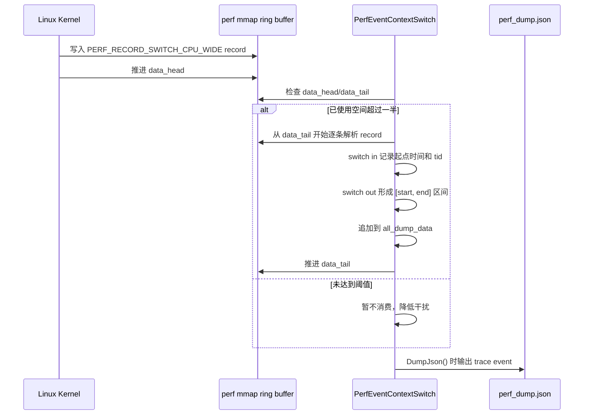

# linux_perf_advance.hpp 教学版说明

这份文档面向第一次接触 `linux_perf_advance.hpp` 的读者，目标是解释三件事：

1. 这份代码解决什么问题。
2. 它背后的 Linux perf 原理是什么。
3. 你应该怎么在自己的代码里使用它。

配套示例见 [sample_profile.cpp](/home/xiuchuan/xiuchuan/workspace/ddzz/tools/profile_advance/sample_profile.cpp)。

## 1. 这份头文件做了什么

`linux_perf_advance.hpp` 是一个 header-only 的轻量 profiler 封装，它把 Linux `perf_event_open` 这套底层接口包装成了更容易直接嵌入业务代码的 C++ API。

它主要提供两类能力：

1. 统计一个作用域内的 PMU / software counter。
2. 在开启 dump 模式时，把 profiling 结果导出成 trace JSON，便于在 Chrome Trace / Perfetto 一类工具里看时间线。

最常用的使用方式就是：

```cpp
auto scope = LinuxPerf::Profile("my_kernel");
do_work();
scope.finish();
```

如果你什么都不额外配置，它默认会为当前线程建立一组常用事件：

1. `HW_CPU_CYCLES`
2. `HW_INSTRUCTIONS`
3. `HW_CACHE_MISSES`
4. `SW_CONTEXT_SWITCHES`
5. `SW_TASK_CLOCK`
6. `SW_PAGE_FAULTS`

这意味着你在一个作用域结束后，既可以看纯硬件计数器，也可以看任务时钟、缺页、上下文切换这类软件事件。

## 2. 底层原理

### 2.1 perf_event_open

Linux 内核提供了 `perf_event_open` 系统调用。你给它一个 `perf_event_attr` 结构，它就会帮你创建一个 perf event 文件描述符。

不同的 `type/config` 组合代表不同的事件类型：

1. `PERF_TYPE_HARDWARE` 对应硬件计数器，比如 cycles、instructions。
2. `PERF_TYPE_SOFTWARE` 对应软件事件，比如 page faults、task clock。
3. `PERF_TYPE_RAW` 对应 CPU 原始事件编码。

这份头文件里，`PerfEventGroup` 负责把多个 event 放进一个 group 中统一启停和读取。

### 2.2 为什么要做 event group

把多个事件放到同一个 group 有两个直接好处：

1. 可以统一 reset / enable / disable，减少测量窗口不一致。
2. 读取时可以一次拿到整组数据，再根据 event id 回填到对应槽位。

这样做能降低 “cycles 是在窗口 A 里采的，instructions 是在窗口 B 里采的” 这种偏差。

### 2.3 为什么既支持 read，又支持 MeasureWithRdpmc

这里有两条读取路径：

1. 常规路径：通过组读取函数从内核读取整组计数器值，本质上还是对 `group_fd` 做 `read(...)`。
2. 快速路径：如果内核允许用户态 `MeasureWithRdpmc`，就直接从 PMC 读，开销更低。

代码里 `PerfEventGroup::enable()` 之后会尝试初始化 `pmc_index`。如果所有 event 都拿到了有效的 PMC index，profile scope 在开始和结束时就能直接读取 PMC，减少 profiling 自身引入的扰动。

### 2.4 为什么时间戳最后统一转成 trace 时间

内部实现使用的是单调时间源：

1. x86 上可以读 TSC。
2. aarch64 上可以读系统计数器。
3. 代码最终统一回落到 `CLOCK_MONOTONIC_RAW`，保证和内核 perf 记录使用的时间基准一致。

这样导出的 trace JSON 时间轴不会因为普通 wall clock 抖动而失真。

### 2.5 context switch 时间线是怎么来的

`PerfEventContextSwitch` 不是统计一个普通 counter，而是为每个目标 CPU 打开 CPU-wide perf event，并用 ring buffer 接收内核写入的 `PERF_RECORD_SWITCH_CPU_WIDE` 记录。

可以把它理解成：

1. 内核不断往 mmap ring buffer 里写 “哪个线程切入 / 切出某个 CPU”。
2. 用户态周期性消费 ring buffer。
3. 最后把每段线程占用 CPU 的时间拼成 trace event。

于是 dump 出来的 JSON 不只有你自己手工打点的 profile scope，还能看到 CPU 上线程切换的背景时间线。

如果展开到实现细节，ring buffer 的使用过程大致是这样的：

1. `PerfEventContextSwitch` 会对每个目标 CPU 调一次 `perf_event_open(&pea, -1, cpu, -1, 0)`，这里的 `pid=-1` 表示统计这个 CPU 上所有线程，属于 CPU-wide 模式。
2. 每个 fd 随后都会被 `mmap` 成一段共享内存。映射的第一页是 `perf_event_mmap_page` 元数据页，后面的 1024 页是实际的数据区，也就是 ring buffer。
3. 内核往数据区写 event record，并通过元数据页里的 `data_head` 告诉用户态“已经写到了哪里”；用户态消费完成后，把 `data_tail` 往前推进，告诉内核“这些数据我已经读完了”。

这里最关键的是 head / tail 分工：

1. `data_head` 由内核生产者推进。
2. `data_tail` 由用户态消费者推进。
3. `[data_tail, data_head)` 这段区间就是“还没被读走的记录”。

当前实现不会每来一条记录就立即解析，而是先看缓冲区是否有必要处理。`NeedsRingBufferUpdate()` 会根据 `data_head - data_tail` 计算已使用空间，只有当使用量超过 ring buffer 一半时，才真正进入消费逻辑。这样做的目的是减少 profiling 过程中频繁读 ring buffer 的开销。

真正消费时，流程是：

1. 先取本次读取的起点 `head0 = data_tail`。
2. 再取终点 `head1 = data_head`。
3. 只要 `head0 < head1`，就不断解析一条 record，并把 `head0` 往后推进 `record.size`。
4. 全部解析完成后，把 `data_tail = head0`，表示这批记录已经被消费，内核可以继续覆盖后续空间。

记录解析本身没有直接把 ring buffer 当成某个固定结构数组来遍历，而是通过一个 cursor 按字段顺序读取：

1. `RingBufferCursor` 持有当前 offset。
2. `ReadRingBuffer<T>()` 会根据 `meta.data_offset + (offset % data_size)` 定位到 ring buffer 中的当前位置。
3. 每读取一个字段，offset 就前进对应的字节数。
4. `ContextSwitchRecord::parse()` 再把这些字段拼成一个逻辑上的 context-switch record。

这样做的意义是，ring buffer 即使在物理上已经回卷，逻辑上仍然可以用单调递增的 offset 顺序消费；真正回卷的细节由 `% data_size` 处理掉。

对于 `PERF_RECORD_SWITCH_CPU_WIDE`，当前代码主要关心两类信息：

1. 这是一次 switch in 还是 switch out，判断依据是 `misc` 里是否带 `PERF_RECORD_MISC_SWITCH_OUT` / `PERF_RECORD_MISC_SWITCH_OUT_PREEMPT`。
2. 这次切换对应的线程 id、CPU id、时间戳分别是什么。

在状态机层面，它的处理逻辑可以简化成：

1. 如果读到 switch in，就把 `ctx_switch_in_time` 和 `ctx_switch_in_tid` 记下来，表示“某个线程从这个时间点开始占用该 CPU”。
2. 如果之后读到同一个 CPU 的 switch out，就用当前 record 的时间减去前面记下的 `ctx_switch_in_time`，得到这段 CPU 占用区间。
3. 这段区间会被追加到 `all_dump_data`，后续统一转成 trace JSON。

为什么还要有 `AppendActiveContextSwitches()` 这一步？因为在 dump JSON 的瞬间，某个 CPU 上可能还有线程正在运行，它已经有 switch in，但还没等到下一条 switch out。此时代码会用“当前时间”补一个临时结束点，确保 trace 里不会丢掉最后这段仍在运行的区间。

最后，ring buffer 的消费时机有两个：

1. 在普通 profile scope 开始时，`PerfEventGroup::BeginProfile()` 会顺手调用一次 `PerfEventContextSwitch::UpdateRingBuffer()`，尽量把调度背景时间线和当前采样窗口对齐。
2. 在最终写 JSON 时，`PerfEventContextSwitch::DumpJson()` 会再消费一次，确保收尾阶段残留的 switch record 也被输出。

所以，这里的 ring buffer 不是用来存业务层 profile 结果的，而是专门作为“内核调度事件到用户态 trace”的桥梁：内核负责写调度事实，用户态负责按 head/tail 协议读出来，再拼成可视化时间线。

如果你更习惯按时序去理解，可以把它看成下面这个过程：



再把 ring buffer 本身画开，会更容易理解为什么代码里只需要维护一个递增 offset：

```text
metadata page:
        data_head -> 内核已经写到哪里
        data_tail -> 用户态已经读到哪里

data pages (ring buffer):

        0 -------------------------------------------------------------- data_size
                | 已消费 |   未消费记录区间 [data_tail, data_head)   | 未来可写入区域 |
                                                                 ^ data_tail                              ^ data_head

逻辑上的读取 offset 可以一直递增；
真正落到物理 buffer 位置时，再用 (offset % data_size) 回卷。
```

这也是 `RingBufferCursor` / `ReadRingBuffer<T>()` 这一层存在的原因：上层代码可以把 ring buffer 当作“顺序字节流”来解析，下层再负责把逻辑 offset 映射回 mmap 环形区域中的真实地址。

## 3. 核心结构怎么读

### 3.1 PerfRawConfig

职责是解析环境变量 `LINUX_PERF`。

它负责三类配置：

1. `dump`：开启 JSON 导出。
2. `switch-cpu`：开启 CPU 级 context switch 时间线。
3. `XXX=...`：注册额外 raw event。

例如：

```bash
LINUX_PERF=dump:switch-cpu:L2_MISS=0x10d1
```

### 3.2 PerfEventJsonDumper

这是最终的 trace 汇聚器。各个 dumper 会把自己注册进来，程序退出或对象析构时统一写出 `perf_dump.json`。

它解决的是两个问题：

1. 多个 profiler 实例的数据如何汇总。
2. header-only 代码被多个 so 同时使用时，如何尽量维持单例行为。

### 3.3 PerfEventGroup

这是最核心的类。它管理一个线程内的 event group，并提供：

1. 事件添加。
2. 统一启停。
3. 读取计数器。
4. 生成 profile scope。
5. dump 成 trace JSON。

你平时直接调用的 `LinuxPerf::Profile(...)`，最终就是落到这里。

从当前实现上看，它内部大致分成这几层：

1. event group 的创建与启停。
2. 两条计数器读取路径：PMC 快路径和 group read 回退路径。
3. `BeginProfile()` / `ProfileScope::finish()` 这一对作用域采样入口。
4. JSON 参数拼装与 trace event 输出。

如果只看职责划分，可以这样理解：

1. `PerfEventGroup` 负责“当前线程这段代码消耗了多少计数器”。
2. `PerfEventContextSwitch` 负责“这个线程什么时候真正跑在某个 CPU 上”。

也就是说，`PerfEventGroup` 是 counter 视角，关注 cycles、instructions、cache misses、task clock 这些指标；`PerfEventContextSwitch` 是调度视角，关注线程切入、切出、是否被抢占，以及它在某个 CPU 上持续了多久。

两者配合后的效果是：

1. 你可以从 `PerfEventGroup` 看到某个 profile scope 的性能开销。
2. 你可以从 `PerfEventContextSwitch` 看到这段时间内线程调度是否干扰了测量。

因此，这两个类不是重复功能，而是互补关系：一个补计数器信息，一个补时间线背景。

### 3.4 ProfileScope

这是典型的 RAII 用法：

1. 创建时记录开始时间和开始计数器。
2. 结束时记录结束时间并计算差值。
3. 析构时自动 `finish()`，避免忘记收尾。

所以最推荐的使用模式是把它定义成局部对象，让生命周期和代码块一致。

## 4. 最小使用方法

示例代码见 [sample_profile.cpp](/home/xiuchuan/xiuchuan/workspace/ddzz/tools/profile_advance/sample_profile.cpp)。

### 4.1 编译

在 `profile_advance` 目录下可以直接用：

```bash
g++ -std=c++11 -O2 -pthread sample_profile.cpp -o sample_profile -lrt
```

有些系统会把 `shm_open` / `shm_unlink` 放在 `librt` 里，所以这里显式带上 `-lrt`，这样更稳妥。

### 4.2 直接运行

```bash
./sample_profile
```

这会在标准输出里打印计算结果和几项常用计数器。

### 4.3 导出 trace JSON

```bash
LINUX_PERF=dump ./sample_profile
```

运行后会生成 `perf_dump.json`。

如果你还想把 CPU 线程切换也打进去：

```bash
LINUX_PERF=dump:switch-cpu ./sample_profile
```

### 4.4 增加 raw event

例如追加一个 raw event：

```bash
LINUX_PERF=dump:MY_EVT=0x10d1 ./sample_profile
```

或者按 `eventsel,umask,cmask` 形式写：

```bash
LINUX_PERF=dump:MY_EVT=0xd1,0x10,0x0 ./sample_profile
```

## 5. sample 在演示什么

sample 做了三件事：

1. `LinuxPerf::Init()` 提前完成默认 profiler 和 context-switch profiler 的初始化。
2. 用一个 `ProfileScope` 包住一段向量计算。
3. 调用 `finish(&counters)`，把本次作用域内的计数器结果提取到 `std::map`。

关键代码如下：

```cpp
LinuxPerf::ProfileScope scope = LinuxPerf::Profile(
        "vector_sin_update",
        std::string("teaching"),
        0,
        static_cast<int64_t>(element_count),
        rounds,
        3.1415926);
result = run_workload(data, rounds);
scope.finish(&counters);
```

这里的额外参数会进入 trace JSON 的 `Extra Data` 字段，用于辅助定位问题时记录上下文。

## 6. 使用时要注意什么

### 6.1 perf_event_open 可能失败

最常见原因是内核限制过严，比如：

1. `/proc/sys/kernel/perf_event_paranoid` 太高。
2. 当前用户没有足够权限。

如果 sample 一运行就失败，先检查：

```bash
cat /proc/sys/kernel/perf_event_paranoid
```

### 6.2 并不是所有机器都能走 MeasureWithRdpmc 快路径

这不是 bug。代码本来就支持回退到组读取路径，只是读数开销会更高。

### 6.3 这是“观测工具”，不是零开销工具

虽然这份代码尽量降低开销，但 profile 本身一定会引入额外扰动。所以：

1. 不要把超短小的几个指令级代码片段当成绝对精确测量对象。
2. 更适合测微秒到毫秒级的 kernel / 算法段。
3. 最好做多次采样，避免单次波动误导结论。

### 6.4 dump 模式适合分析结构，不适合无限制长跑

开启 `dump` 后，所有 profile 记录会积累到内存里，最后统一输出 JSON。长时间运行场景要注意数据量。

## 7. 什么时候该用这个工具

适合：

1. 想快速给某段 C++ 代码打点。
2. 想同时看 cycles、instructions、cache miss。
3. 想导出 trace，观察不同阶段的时间分布。
4. 想在算法开发阶段快速做局部性能比较。

不太适合：

1. 需要全系统级 perf 分析替代 `perf record` 的场景。
2. 需要非常严谨的基准框架控制变量、绑核、预热、统计显著性的场景。
3. 非 Linux 环境。

## 8. 一个实用工作流

建议按这个顺序使用：

1. 先直接用 `Profile("name")` 包住关键阶段。
2. 看标准输出里的 counters，确定是不是 CPU bound、memory bound，或者有异常 page fault / context switch。
3. 如果需要看阶段结构，再加 `LINUX_PERF=dump` 导出 trace。
4. 如果怀疑线程调度干扰，再加 `switch-cpu` 看上下文切换。
5. 如果还不够，再补 raw event。

这个顺序的好处是：先用最小成本拿到方向，再逐步加观测深度。